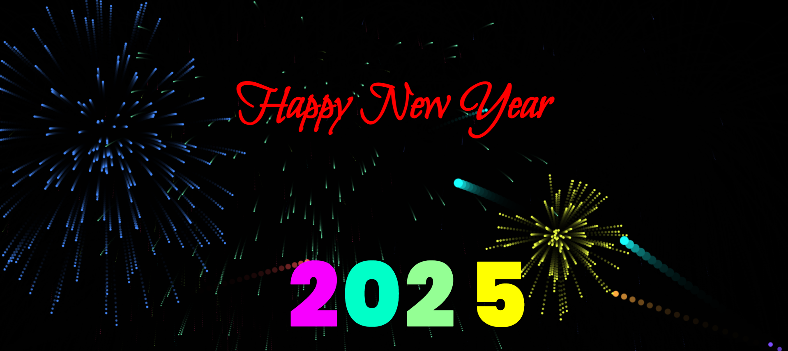

# Happy New Year Again 

**Happy New Year Again** is a vibrant and visually appealing animation to celebrate the New Year with style! Featuring colorful text animations, balloons, fireworks, and a cheerful design, this project is perfect for welcoming the new year.

## Features   
- Fireworks and animated balloons.  
- Vibrant text animations for "Happy New Year!" messages.  
- Responsive design for desktop and mobile.  
- Clickable interactive elements like balloons.  
- Customizable themes for colors and animation speed.   
  

## How It Works 
1. Clone or download the repository.
2. Open the `index.html` file in your browser.
3. Enjoy the New Year celebration with fireworks, colorful text, and animated balloons!

## Screenshot 
-It looks something like this:
  

## Future Enhancements 
- Interactive elements for user engagement.
- More customization options for animation effects.
- Support for mobile devices.
- Addition of sound effects for a more immersive experience.

## Benefits 
- Enhances festive celebrations with vibrant animations.
- Creates a joyful and immersive New Year experience.
- Works seamlessly across modern browsers.

## Contribution 
We welcome contributions from anyone who wants to enhance or improve this project! If you’d like to contribute:

1. Fork the repository.
2. Make your changes.
3. Submit a pull request.
4. We'll review and merge it.

Thank you for your support!

---

### Happy New Year! 🎆
